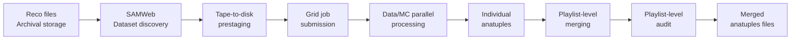

# Anatuple Production

This directory contains the distributed data-production workflow used to transform reconstructed MINERvA data and Monte Carlo samples into the analysis-ready ROOT files used by the CCπ⁰ cross-section analysis, known as ***anatuples***.

The production pipeline processed large collections of MINERvA *reconstruction files* using Fermilab's grid-computing and data-storage infrastructure. This workflow included dataset discovery, archival-storage staging, job submission, parallel processing, output merging, and production validation.

## Production Workflow

## Production Environment

- **`set_Minerva_CCPi0_submit.sh`** – Configures the software environment required for anatuple production, including the MINERvA software and [Gaudi](https://www.sciencedirect.com/science/article/abs/pii/S0010465501002545)-based configuration used by the reconstruction workflow, now part of the MINERvA legacy software.

## Data Preparation and Staging

The production workflow uses SAM, Fermilab's data-handling system, to locate and manage experimental and simulated datasets.

MINERvA reconstruction files could reside either *on disk* on in long-term archival *tape* storage. Files stored on tape had to be *prestaged* to disk before processing jobs could access them.

The scripts below ensure that input reconstruction files are available before large production jobs are submitted.

- **`setup_samweb.sh`** – Initializes the SAM environment.

- **`samweb_options.sh`** – Queries the availability of required datasets and manages prestaging of files when necessary.

## Distributed Production

Once the required input reconstructed files are available on disk, the workflow distributes processing across Fermilab grid-computing infrastructure.

MINERvA datasets are organized hierarchically into **playlists**, **runs**, and **subruns**. A playlist represents a collection of data or Monte Carlo samples and is subdivided
into runs and, subsequently, subruns. This analysis processes 12 playlists.

The production workflow preserves this organization while allowing processing to be performed at different levels of granularity:

- **`submit_jobs.sh`** – Submits grid jobs that processes reconstruction files into anatuples. Jobs can be configured to process an entire playlist, a specific run, or an individual subrun, for either experimental data or Monte Carlo samples. Computing-resource requirements can also be configured for the submitted jobs. Each input reconstruction file produces one corresponding anatuple, preserving a one-to-one relationship between the reconstructed input and analysis-ready output files.

- **`submit_test.sh`** – Submits a small production grid job for testing purposes before launching larger processing campaigns.

This approach allows processing independent subsets of the dataset to be processed while retaining the playlist/run/subrun structure of the MINERvA datasets.

## Merging and Validation

Distributed production generates many independent output files. These outputs must be consolidated and checked before they are used by the physics analysis.

- **`submit_merge.sh`** – Submits grid jobs that merge individual anatuples belonging to a given playlist into a single playlist-level analysis file. Since this analysis uses 12 playlists, the complete production workflow produces 12 merged anatuple files.

- **`submit_audit.sh`** – Submits grid jobs to audit the merged production output to verify that the expected individual anatuples were successfully incorporated.

## Technical Highlights

This directory demonstrates experience with:

- Data / Monte Carlo workflow separation.
- Large-scale experimental datasets.
- Archival tape and disk storage.
- Data prestaging and data locality.
- Distributed and grid computing.
- Compute-resource configuration.
- Production auditing and validation.

## Historical Disclaimer

This software was developed within the MINERvA experiment software ecosystem and depends on the historical Fermilab computing environment in which the analysis was performed.

The repository preserves the original research software and therefore contains experiment-specific dependencies, filesystem locations, storage systems, dataset definitions, grid services, and paths from that environment. It is intended as a record of the analysis implementation and scientific-computing methodology rather than as a standalone modern software package.