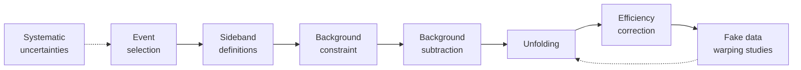

# CCπ⁰ Cross-Section Analysis Software

This directory contains the core C++ and Python software developed for the measurement of neutrino-induced charged-current single-neutral-pion (CCπ⁰) production on lead and iron nuclear targets.

The software implements the physics-analysis pipeline from reconstructed detector events to differential cross sections. It combines object-oriented C++ analysis code, ROOT-based data processing, Monte Carlo simulation, statistical analysis, systematic uncertainty propagation, detector unfolding, and computing tools for execution on Fermilab grid-computing resources.

## Analysis Workflow

A reconstructed event cannot be interpreted directly as a physical cross section. The analysis must first isolate CCπ⁰ candidate events, estimate and constrain backgrounds, correct detector-induced migration and reconstruction efficiency, and normalize the corrected event distributions by neutrino exposure and number of targets.

Therefore, the analysis follows the sequence:

## Software Architecture

The **`includes/`** directory contains the C++ components shared across the analysis.

Classes built on [MAT](https://github.com/MinervaExpt/MAT) represent histograms, physics variables, events, event-selection requirements, background categories, and other C++ objects specifically dedicated to the analysis.

Classes that are built on [MAT-MINERvA](https://github.com/MinervaExpt/MAT-MINERvA) provide the functionality needed to construct the multiple systematic universes required to quantify uncertainties.

In addition, `includes/` contains classes dedicated to other analysis stages like background fitting and constrain, as well as the visualization of physics observables based on different categories.

## Cut and Support Studies

The **`CutStudies/`** and **`SupportStudies/`** directories contain complementary studies used to investigate, and validate the event selection requirements used to identify CCπ⁰ candidate events.

`CutStudies/` studies individual selection requirements to understand their effects on signal efficiency and background rejection. `SupportStudies/` provides auxiliary tools for investigating reconstructed events, examining detector-level information, and studying the behavior of particular selection requirements.

Together, these studies support the development and validation of the cuts subsequently applied by the main event-selection stage.

## Interaction Models and Systematic Uncertainties

### Monte Carlo Interaction Models

The nominal Monte Carlo neutrino interaction model used by this analysis is **MnvGENIE v1**, based on the [GENIE neutrino event generator](https://genie-mc.github.io/) (version 2.6.12) with specific modifications motivated by previous neutrino-nucleus measurements, including earlier MINERvA results.

MINERvA also uses alternative interaction model configurations. These models provide different predictions for neutrino-nucleus interactions and are useful for testing how strongly analysis procedures depend on the nominal Monte Carlo model.

### Systematic Uncertainties and the Many-Universe Technique

An essential part of the analysis is the propagation of systematic uncertainties. The nominal simulation defines the **central-value (CV) universe**, corresponding to the default values of the physics and detector-model parameters used by the analysis.

A **systematic universe** represents an alternative hypothetical realization of the experiment in which one source of uncertainty is varied relative to the central value. The complete event-selection procedure can then be repeated under these variations to determine how the predicted distributions and extracted physics quantities change. Many sources of uncertainty require multiple such variations, producing collections of systematic universes.

The analysis uses the systematic-universe infrastructure provided by MAT and MAT-MINERvA to propagate these variations through the relevant stages of the analysis. Systematic sources include uncertainties associated with the neutrino flux, neutrino interaction model, detector response, particle reconstruction, and other experiment-specific effects.

The **many-universe technique** allows systematic effects to be propagated through the event-level analysis rather than being applied only as final uncertainties on the measured cross sections.

## Event Selection

The **`EventSelection/`** directory performs the primary event-level processing of the CCπ⁰ analysis.

The event selection stage applies the analysis cuts to the data and Monte Carlo samples, classifies the selected simulated events, and produces the histogram distributions required by subsequent analysis stages.

In addition to processing the CV prediction, the analysis generates and processes the alternative systematic universes defined through the many-universe technique. The relevant event quantities and selections are reevaluated for these universes, allowing systematic variations to propagate into the resulting distributions.

## Sideband Studies and Background Constraint

The **`SidebandStudies/`** directory constructs background-enriched control samples used to study and constrain background contributions to the selected CCπ⁰ sample. Sideband samples are obtained using selections designed to enhance particular background contributions relative to the signal.

Data in these regions are compared with the Monte Carlo prediction and used to constrain relevant background components. This provides a data-driven background constraint while retaining the simulation-based description of the signal and detector response.

## Fake-Data and Warping Studies

The **`FakeDataModels/`** and **`WarpingStudies/`** directories work together to study the model dependence and iteration choice of the unfolding procedure.

Alternative neutrino interaction models are first used by `FakeDataModels/` to construct **fake-data** distributions. In this context, fake data do not represent fabricated experimental measurements. Instead, an alternative Monte Carlo model is temporarily treated as a hypothetical description of nature. The analysis can then test how well its nominal methodology would recover the underlying distribution if the true neutrino interaction behavior differed from the MnvGENIE v1 prediction.

These fake-data distributions are subsequently used by `WarpingStudies/` to test the iterative unfolding procedure. Detector smearing causes events generated in one true kinematic bin to sometimes be reconstructed in another. The analysis corrects this bin migration using iterative unfolding.

The number of unfolding iterations represents a tradeoff: too few iterations can retain excessive dependence on the nominal Monte Carlo model, while too many can amplify statistical fluctuations. The warping studies therefore test the unfolding procedure against the alternative fake-data hypotheses and determine an appropriate number of iterations for the measurement.

## Unfolding Statistical Studies

The **`UnfoldStatStudies/`** directory provides an additional layer of validation for the unfolding procedure by investigating its statistical behavior and uncertainty propagation. These studies complement the fake-data and warping tests by verifying that the selected number of unfolding iterations does not induce unphysical statistical fluctuations.

## Efficiency Studies

The **`EfficiencyStudies/`** directory contains studies associated with the reconstruction and selection efficiencies used by the analysis. Efficiency corrections account for signal interactions within the analysis phase space that are not successfully reconstructed or selected.

## Cross-Section Extraction

The **`CrossSectionExtraction/`** directory implements the final measurement pipeline.

The extraction combines:

1. Selected experimental data.
2. Constrained-background subtraction.
3. Detector unfolding.
4. Efficiency correction.
5. Neutrino flux and target normalization.

The complete procedure transforms the observed event distributions into a differential cross-section measurement.

## Cross-Section Model Comparisons

The **`XsectionModels/`** directory studies the extracted cross sections in the context of different neutrino interaction model predictions. These comparisons provide a way to evaluate how different interaction models describe the measured CCπ⁰ cross sections relative to the nominal model prediction.

## Distributed Analysis Processing

Several stages of the analysis require substantially more processing than is practical in an interactive computing session. The complete dataset consists of 12 merged playlist files. Each contains a large number of reconstructed events, and systematic studies further increase the computational load because events must be processed under many alternative systematic universes.

Computationally intensive stages are therefore distributed across Fermilab's grid-computing infrastructure.

### `SubmitJobsToGrid.py`

This tool provides a common interface for submitting computationally intensive analysis stages to the Fermilab grid. It can submit jobs for stages including:

- Cut studies
- Event selection
- Sideband studies
- Fake-data generation

Grid jobs can be configured to process an individual merged playlist, allowing the analysis workload to be divided across independent jobs.

The script also manages the configuration required for grid execution, including the selected analysis stage, playlist selection, processing identifiers, software packaging, computing-resource requirements, and output organization.

In addition, **grid_macro.sh** manages grid-side execution support for submitted analysis jobs, while **`rootlogon_grid.C`** provides the custom configuration of the ROOT session when processing grid-produced outputs.

### Bash Automation

The **`bash_scripts/`** directory contains Bash utilities for automating the analysis workflow. This includes processing grid outputs, merging files, and other workflow tasks.

## Technical Highlights

This software demonstrates experience with:

- Object-oriented C++ design.
- Class inheritance.
- Monte Carlo simulation.
- Event-level scientific data processing.
- Multi-universe systematic uncertainty propagation.
- Statistical fitting and data-driven background constraints.
- Detector-response correction and iterative unfolding.
- Model-dependence and fake-data studies.
- Scientific visualization.
- Python-based job orchestration.
- Bash workflow automation.
- Distributed and grid computing.

## Historical Disclaimer

This software was developed within the MINERvA experiment software ecosystem and depends on the historical Fermilab computing environment in which the analysis was performed.

The repository preserves the original research software and therefore contains experiment-specific dependencies, filesystem locations, storage systems, dataset definitions, grid services, and paths from that environment. It is intended as a record of the analysis implementation and scientific-computing methodology rather than as a standalone modern software package.