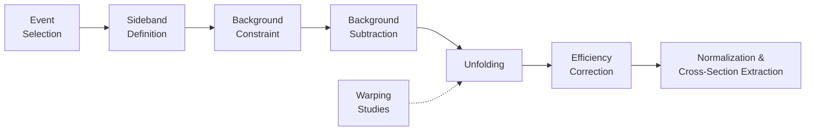

# CCπ0 Macros

This directory contains the core C++ and Phyton software developed to perform the cross-section analysis of neutrino-induced CCπ⁰ production events on lead and iron.

The analysis is organized as a sequence of processing steps, including event selection, background studies and constraint, unfolding, efficiency correction, proton-on-target (POT) normalization, cross-section extraction, and comparison with alternative neutrino-interaction models.

- `includes/` – Defines the object-oriented C++ classes uses throughout the analysis. These classes are built on [MAT](https://github.com/MinervaExpt/MAT), and provide the common definitions of event, variables, histograms, selection, and infrastructure used by the analysis.

- `CutStudies/` – Studies the individual event-selection criteria used to suppress as much background as possible while retaining **CCπ⁰ signal** events. These studies were used to ultimately define the final selection applied before the cross-section extraction.

- `EventSelection/` – Processes and visualizes the CCπ⁰ production sample obtained after the event selection and its associated backgrounds. These backgrounds include interaction originating outside the lead and iron targets, mostly in the surrounding plastic scintillator, as well as non-CCπ⁰ events predicted by the physics interaction model used in this analysis –called **"MINERvA v1"**–.

- `SidebandStudies/` – Studies background-enriched control samples (**sidebands**), obtained by modifying specific event-selection requirements. Sidebands are used to characterize non-CCπ⁰ signal events of different types and constrain their contributions to the selected sample.

- `FakeDataModels/` – Generates distributions from alternative interaction models and treate them as *fake-data* hypotheses for the unfolding procedure.

- `WarpingStudies/` – Determines the number of iterations needed by the D'Agostini iterative unfolding, a technique used to correct reconstructed distributions caused by detector-induced bin migration. The studies are used to select an interation number that minimizes the unfolding bias.

- `UnfoldStatStudies/` – Studies about the propagation of statistical uncertainties associated to the unfolding procedure in bins with low number of events.

- `EfficiencyStudies/` – Studies the loss or gain of efficiency associated with the final-state muon angular distribution.

- `CrossSectionExtraction/` – Performs the overall cross-section measurement using the input of all previous steps: subtraction of the constrained background, optimized unfolding, efficiency correction, and normalization per POT.

- `XsectionModels/` – Produces cross-section results under alternative interaction models for comparison with the nominal "MINERvA v1" model using a common event selection.

## Supporting tools

The following scripts support the analysis analysis workflow and execution.

- `SupportStudies/` – Contains auxiliary studies, primarily focused on locating and inspecting specific events with the [Arachne](https://www.sciencedirect.com/science/article/abs/pii/S0168900212001167?via%3Dihub) event viewer.

- `loadLibs.C` – Loads and compiles all libraries required by the analysis.

- `loadClasses.C` – Loads the core analysis classes defined in `includes/`. Executed when `loadLibs.C` is compiled.

- `SubmitJobsToGrid.py` – Submit grid-computing jobs to Fermilab's distributed computing infrastructure, allowed individual stages of the analysis to be processed in a timely manner.

- `rootlogon_grid.C` – Custom configuration of the ROOT session when processing specific grid-produced outputs.

- `clean.sh` – Removes generated shared object and dependency files.

## Analysis Workflow

The CCπ⁰ cross-section measurement is organized as follows:

