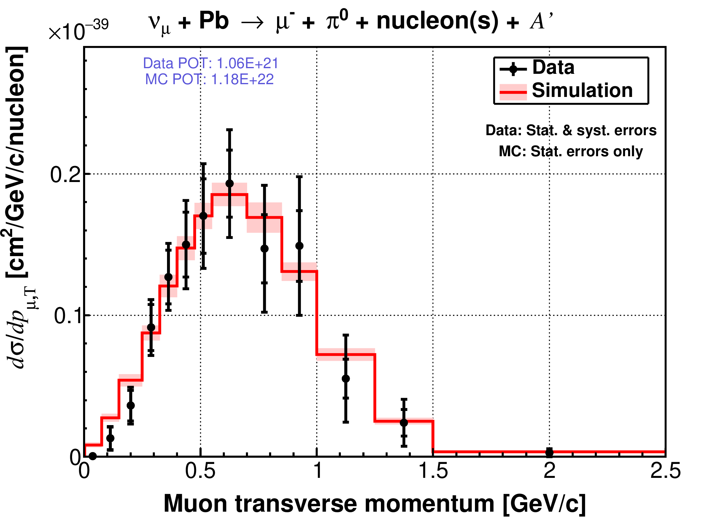
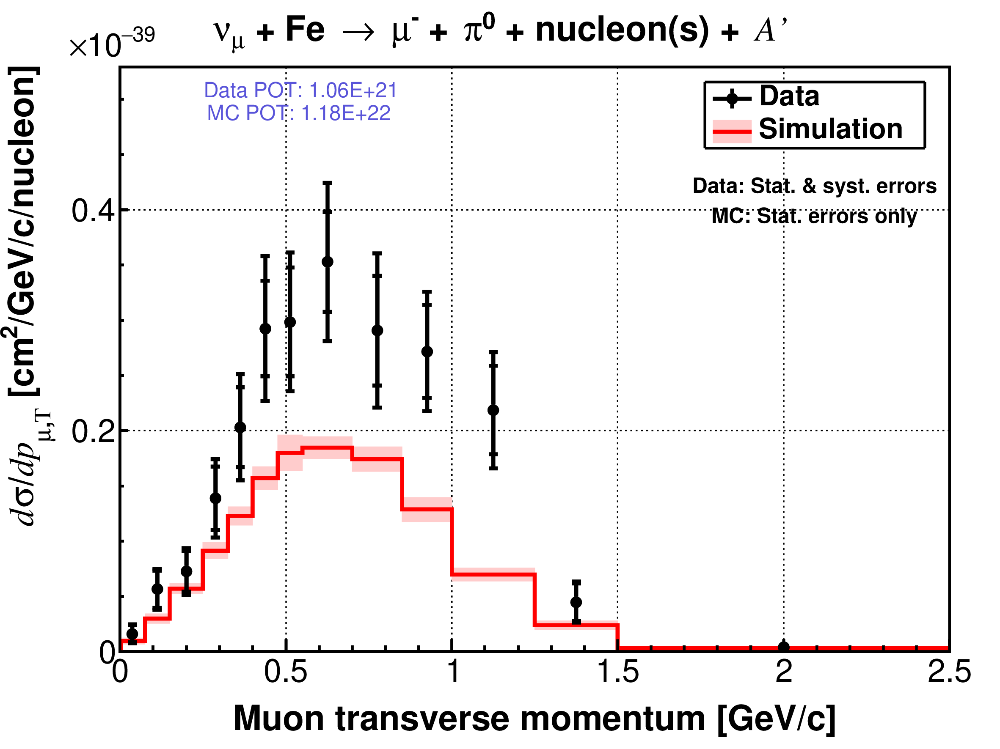

# MINERvA CCπ⁰ Analysis

This repository contains C++, Python, and Bash software developed for my doctoral research with the MINERvA Collaboration at the University of Rochester and Fermi National Accelerator Laboratory (Fermilab).

This code supported the analysis of neutrino-induced charged-current single-neutral pion (CCπ⁰) production on lead and iron targets, completed as part of my [doctoral thesis](https://inspirehep.net/literature/2626020) in 2022.

This project includes software for configuring the analysis environment, processing large experimental datasets using Fermilab's computing resources, and performing the event-level analysis leading to a cross-section measurement.

## Technical Highlights

This project demonstrates experience with:

- C, C++ and Python development for scientific data processing and analysis.

- Object-oriented software design.

- Bash tools for configuring and automating analysis workflows.

- Distributed and grid computing for processing large-scale experimental and Monte Carlo datasets.

- Statistical and systematic uncertainty analysis using data-driven techniques.

- ROOT-based data analysis, including histogramming, numerical analysis, and data visualization.

- End-to-end analysis workflows, from production of datasets to cross-section analysis of such datasets.

## Repository Structure

### `Setup/`

Environment configuration and build for the MINERvA software suite needed to properly run the analysis on the Fermilab computing system.

### `AnatupleProduction/`

Scripts for producing analysis-ready ROOT objects (*anatuples*) using Fermilab's distributed computing and data-storage infrastructure.

### `CCPi0_Macros/`

Primary C++, Python, and Bash analysis software, including event selection, background estimation and suppression, unfolding, systematic uncertainties evaluation, and cross-section extraction.

## Research outcome

The following are the results of neutrino-induced CCπ⁰ production on lead and iron nuclear targets by this analysis, as function of the final-state muon transverse momentum. The full extent of my analysis can be seen in my [doctoral thesis](https://inspirehep.net/literature/2626020).

  
  

  <em>CCπ⁰ cross-section measurements on lead (left) and iron (right).</em>

## Software Environment

The analysis was originally developed using the [MINERvA Experiment software](https://github.com/MinervaExpt) ecosystem, including:

- [MAT](https://github.com/MinervaExpt/MAT)
- [MAT-MINERvA](https://github.com/MinervaExpt/MAT-MINERvA)
- [UnfoldUtils](https://github.com/MinervaExpt/UnfoldUtils)
- [GENIEXSecExtract](https://github.com/MinervaExpt/GENIEXSecExtract)

This repository preserves the software in the context of the historical MINERvA software environment in which the analysis was developed. This is intended as a record of the analysis software.