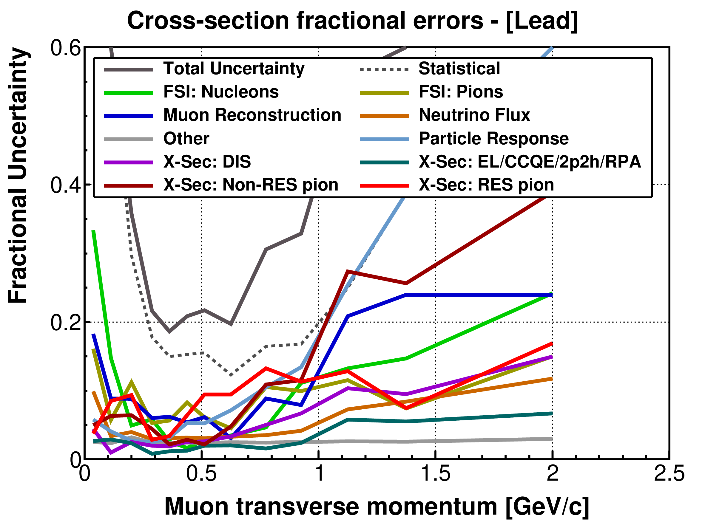
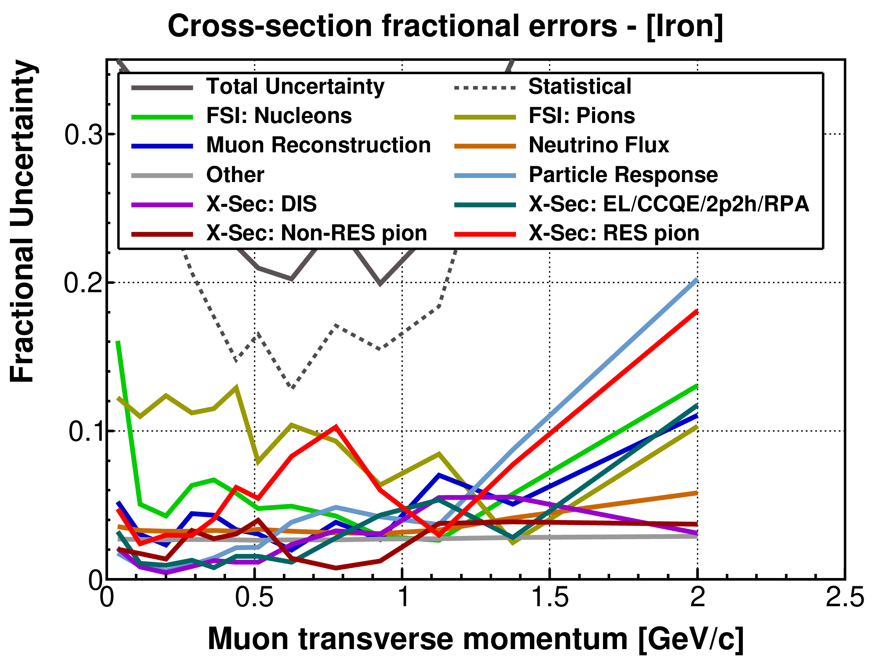

# MINERvA CCπ⁰ Cross-Section Analysis

This repository contains the scientific software developed for my doctoral research with the MINERvA Collaboration at the University of Rochester and Fermi National Accelerator Laboratory (Fermilab).

The project studied neutrino-induced charged-current single-neutral-pion (CCπ⁰) production on lead and iron nuclear targets and was completed in 2022 as part of my doctoral thesis:

[Measurement of $\nu$CC1$\pi^0$ cross section on heavy nuclei in MINERvA](https://inspirehep.net/literature/2626020)

The repository covers the analysis workflow from software environment configuration and distributed processing of experimental and Monte Carlo datasets to event selection,
systematic uncertainty studies, detector unfolding, and cross-section extraction.

## Technical Highlights

This project demonstrates experience with:

- C++ and Python development for scientific data processing and analysis.
- Object-oriented software design and class inheritance.
- Bash scripting for scientific software configuration and workflow automation.
- Distributed and grid computing for large-scale datasets.
- Monte Carlo simulation.
- Statistical analysis.
- Systematic uncertainty propagation.
- ROOT-based event processing, histogramming, analysis, and visualization.
- End-to-end scientific workflows, from dataset production to cross-section measurement.

## Repository Structure

### `Setup/`

Environment configuration and build tools for the MINERvA software used to run the analysis on the Fermilab computing system.

### `AnatupleProduction/`

Distributed data-production workflow for transforming reconstructed datasets into analysis-ready ROOT files.

### `CCPi0_Macros/`

Core C++, Bash and Python analysis software for event selection, background estimation and suppression, detector unfolding, systematic uncertainties propagation, and cross-section extraction.

## Research Outcome

The analysis measured neutrino-induced CCπ⁰ production on lead and iron nuclear targets.

The figures below show the measured differential cross sections as a function of the final-state muon transverse momentum and their associated systematic uncertainties.

  
  

  <em>CCπ⁰ cross-section measurements on lead (left) and iron (right).</em>

  
  

  <em>Fractional systematic uncertainties on the CCπ⁰ cross-section on lead (left) and iron (right).</em>

The complete analysis, physics motivation, methodology, and results are documented in my [doctoral thesis](https://inspirehep.net/literature/2626020).

## Historical Software Environment

This analysis was developed within the [MINERvA Experiment software](https://github.com/MinervaExpt) ecosystem:

- [MAT](https://github.com/MinervaExpt/MAT)
- [MAT-MINERvA](https://github.com/MinervaExpt/MAT-MINERvA)
- [UnfoldUtils](https://github.com/MinervaExpt/UnfoldUtils)
- [GENIEXSecExtract](https://github.com/MinervaExpt/GENIEXSecExtract)

The repository preserves the research software in the historical Fermilab/MINERvA computing environment in which the analysis was performed. It is intended as a record of the analysis implementation and scientific-computing methodology rather than as a standalone modern software package.