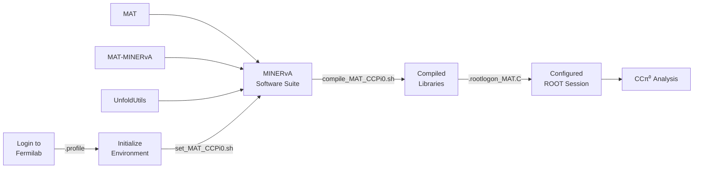

# Setup

This directory contains the environment setup scripts for the MINERvA CCπ⁰ nuclear target analysis on Fermilab computing systems.

The following scripts configure the required software suite and provide an environment for building and running the analysis.

- `.profile` – Configures the analysis environment automatically when logging into a Fermilab virtual machine.

- `set_MAT_CCPi0.sh` – Initializes the software environment required by the analysis, including [MAT](https://github.com/MinervaExpt/MAT), [MAT-MINERvA](https://github.com/MinervaExpt/MAT-MINERvA), [UnfoldUtils](https://github.com/MinervaExpt/UnfoldUtils).

- `update_MAT_CCPi0.sh` – Updates the MINERvA software dependencies used by the analysis.

- `compile_MAT_CCPi0.sh` – Rebuilds the required MINERvA software packages after updates.

- `.rootlogon_MAT.C` – Configures the ROOT framework session for the analysis.

## Workflow

